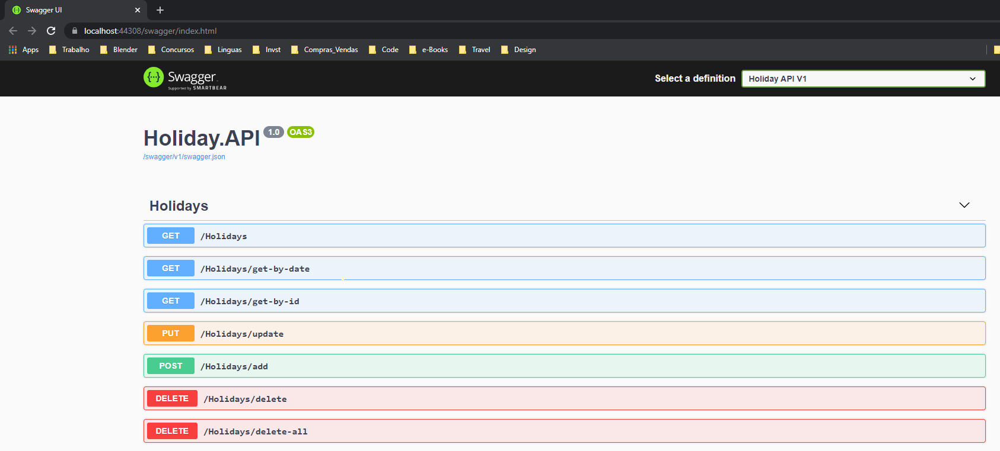
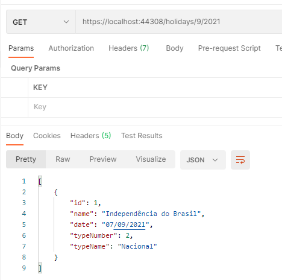
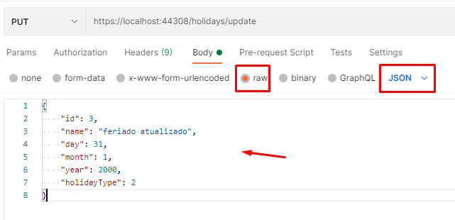
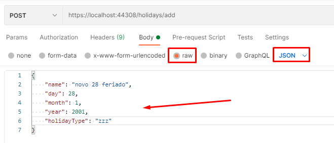
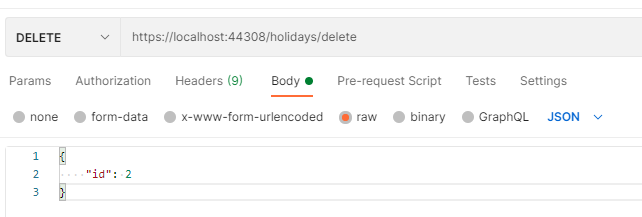
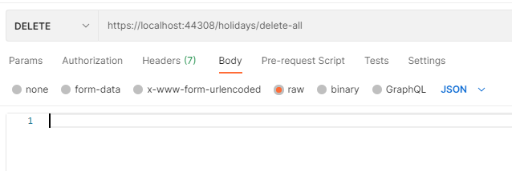

# Teste 2 - API de Feriados

Com esta WebAPI é possível realizar a consulta, cadastro, alteração e remoção de feriados.
Cada feriado contém um ID, para que seja possível cadastrar um ou mais feriados para a mesma data.
Este projeto utiliza InMemoryData e inicialmente há três feriados cadastrados. Podemos ver estes feriados na classe InMemoryData no projeto Holidays.Repository

## Como executar

```javascript
var x = 10;
```

Abra o projeto Holiday.API e o execute.
Uma janela do browser irá abrir com a tela inicial do swagger mostrando os endpoints disponíveis.



---

## Consultando um feriado

Para consultar feriados, a API dispõe de três endpoints:

    1.  /holidays
        Este endpoint retornará todos os feriados cadastrados.
    2.  /holidays/get-by-date
        Neste endpoint, conseguimos obter todos os feriados cadastrados para um mês e ano.
        Para isto, precisamos passar no body da requisição um JSON com o mês e ano desejados:
```javascript
{
    "month": 9,
    "year": 2001
}
```


    3.  /holidays/get-by-id
        Por este endepoint, obtemos um feriado específico passando um ID no body da requisição:

```javascript
{
    "id": 4
}
```


---

## Atualizando um feriado

Para atualizar um feriado, dispomos de um endpoint:

    1.  /holidays/update
        Precisamos passar no corpo da requisição o ID do feriado, como também todos os campos que precisam ser atualizados:
```javascript
{
    "id": 3,
    "name": "feriado atualizado",
    "day": 31,
    "month": 1,
    "year": 2000,
    "holidayType": 2
}
```


---

## Adicionando um feriado

Para adicionar um feriado, dispomos de um endpoint:

    1.  /holidays/add
        Precisamos passar no corpo da requisição todos os campos que precisam ser atualizados. O ID do novo feriado será gerado automáticamente:
```javascript
{
    "name": "novo 28 feriado",
    "day": 28,
    "month": 1,
    "year": 2001,
    "holidayType": "zzz"
}
```


---

## Removendo feriados

Para remover feriados, dispomos de dois endpoints:

    1.  /holidays/delete
        Este remove um único feriado de acordo com o ID informado no body da requisição:
```javascript
{
    "id": 2
}
```


    2.  /holidays/delete-all
        Este endpoint remove todos os feriados, não precisamos passar nenhum parâmetro.

