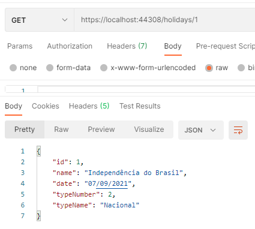
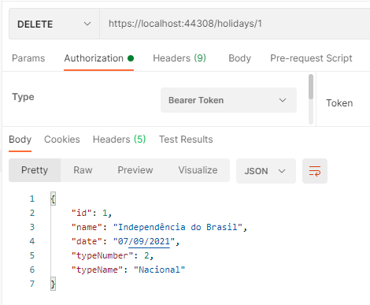

# Teste 2 - API de Feriados :calendar:

Com esta WebAPI é possível realizar a consulta, cadastro, alteração e remoção de feriados.
Cada feriado contém um ID, para que seja possível cadastrar um ou mais feriados para a mesma data.
Este projeto utiliza InMemoryData e inicialmente há três feriados cadastrados. Podemos ver estes feriados na classe __InMemoryData__ no projeto __Holidays.Repository__

## Como rodar o projeto

Abra o projeto Holiday.API e o execute.
Uma janela do browser irá abrir com a tela inicial do swagger mostrando os endpoints disponíveis.

_As chamadas às APIs exibidas neste documento foram realizadas com a ferramenta **Postman**_


---

## :exclamation: Como utilizar
Foi implementado um esquema de autorização por token (JWT).
O projeto utiliza uma chave para geração de token. Como esta chave não pode ser compartilhada em um versionador, ela está sendo gravada em um arquivo de secrets.

:key: É necessário incluir uma chave que será utilizada no processo de autenticação.
1.  clique com o botão direito no projeto **Holiday.API**.
2.  Selecione a opção **Manage User Secrets**:

    

3.  Insira uma chave como no exemplo abaixo:

    

:x: Se a chave não estiver configurada. Ocorrerá exceção ao tentar gerar o token pelo endpoint de login (_/user/login_).

---

Para alguns endpoints, não é necessário estar autenticado, para outros, sim.

-   Não é necessário estar autenticado em todos os endpoints para obtenção (GET) dos feriados
-   É preciso estar autenticado e autorizado como USER ou ADMIN para adição de um feriado 
-   É necessário estar autenticado e autorizado como ADMIN para atualização e remoção de feriados

Veja a relação na tabela abaixo:

| Method | Endpoint                            | Role          |
| ------ | ----------------------------------- |-------------  |
| GET    | /Holidays                           | N/A           |
| GET    | /Holidays/{month}/{year}            | N/A           |
| GET    | /Holidays/{id}                      | N/A           |
| PUT    | /Holidays/update                    | ADMIN         |
| POST   | /Holidays/add                       | USER ou ADMIN |
| DELETE | /Holidays/{id}                      | ADMIN         |
| DELETE | /Holidays/delete-all                | ADMIN         |

## :unlock: Autenticação
Para realizar o login e obter um token, utilize o endpoint **/user/login**
Informe no body da requisição o usuário e a senha.
Caso o usuário e a senha estejam corretos, você receberá no corpo da resposta o token de autenticação.


Com o token em mãos, basta selecionar o tipo de autorização **Bearer Token** na aba Authorization e informar o token.


-   ### Autenticação como **USER**
    Para obter um token e ser autorizado como USER, basta utilizar o usuário ramon e a senha 12345

-   ### Autenticação como **ADMIN**
    Para obter um token e ser autorizado como USER, basta utilizar o usuário felipe e a senha 54321

---
---

## Consultando um feriado
_permite modo anônimo. Não é necessário token_

Para consultar feriados, a API dispõe de três endpoints:

    1.  /holidays
        Este endpoint retornará todos os feriados cadastrados.
    2.  /holidays/{month}/{year}
        Neste endpoint, conseguimos obter todos os feriados cadastrados para um mês e ano.


    3.  /holidays/{id}
        Por este endepoint, obtemos um feriado específico passando um ID na URL da requisição:



---

## Atualizando um feriado

_Para **atualizar** é necessário estar autorizado como **ADMIN**_

Para atualizar um feriado, dispomos de um endpoint:

    1.  /holidays/update
        Precisamos passar no corpo da requisição o ID do feriado, como também todos os campos que precisam ser atualizados:
```javascript
{
    "id": 3,
    "name": "feriado atualizado",
    "day": 31,
    "month": 1,
    "year": 2000,
    "holidayType": 2
}
```


---

## Adicionando um feriado

_Para **adicionar** é necessário estar autorizado como **USER** ou **ADMIN**_

Para adicionar um feriado, dispomos de um endpoint:

    1.  /holidays/add
        Precisamos passar no corpo da requisição todos os campos que precisam ser atualizados. O ID do novo feriado será gerado automáticamente:
```javascript
{
    "name": "novo 28 feriado",
    "day": 28,
    "month": 1,
    "year": 2001,
    "holidayType": "zzz"
}
```


---

## Removendo feriados

_Para **remover** é necessário estar autorizado como **ADMIN**_

Para remover feriados, dispomos de dois endpoints:

    1.  /holidays/{id}
        Este remove um único feriado de acordo com o ID informado no body da requisição:


    2.  /holidays/delete-all
        Este endpoint remove todos os feriados, não precisamos passar nenhum parâmetro.

